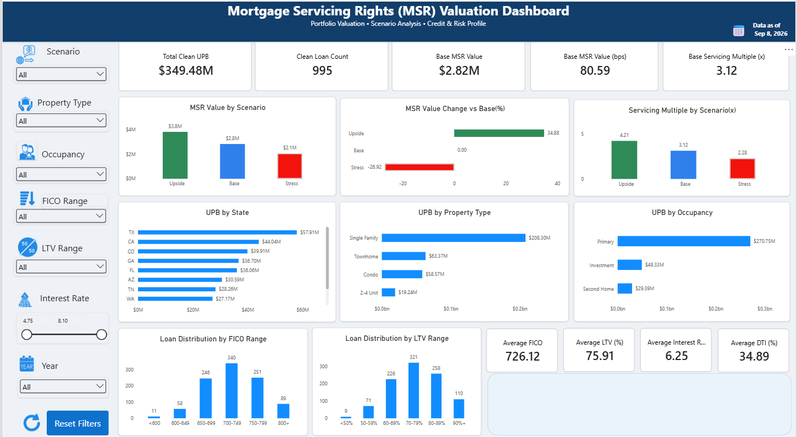

# Mortgage Servicing Rights (MSR) Valuation & Analytics

## Project Overview

This project analyzes and values a Mortgage Servicing Rights (MSR) portfolio using PostgreSQL, Excel, and Power BI.

The original portfolio contains 1,000 mortgage loans. After performing data quality checks, 995 loans with approximately $349.48 million in unpaid principal balance (UPB) were included in the valuation.

The project models monthly servicing cash flows while incorporating scheduled principal payments, prepayments, defaults, servicing costs, ancillary revenue, and discounting. Scenario analysis is used to evaluate how changes in CPR, default rates, and discount rates affect the estimated MSR value.

## Dashboard Preview



## Tools Used

- **Excel** – Initial data validation, quality checks, and manual MSR calculation validation
- **PostgreSQL** – Data cleaning, transformation, monthly cash flow projections, and MSR valuation
- **SQL** – Recursive CTEs, scenario modeling, aggregation, and portfolio-level analysis
- **Power BI** – Interactive dashboard, portfolio analysis, and data visualization
- **DAX** – KPI measures, calculated columns, and dashboard calculations

- ## Data Quality

The original dataset contained 1,000 mortgage loans. Before performing the valuation, data quality checks were used to identify records that could affect the accuracy of the analysis.

The validation checks included:

- Negative current loan balances
- Missing FICO scores
- Invalid property states
- Invalid servicing fee rates
- Invalid remaining loan terms

After cleaning the data:

- **Original Loans:** 1,000
- **Clean Loans:** 995
- **Clean Portfolio UPB:** $349.48 million
- **Data Error Rate:** 0.50%

- ## MSR Valuation Methodology

The model projects monthly servicing cash flows at the individual loan level and discounts those cash flows to estimate the present value of the MSR portfolio.

The monthly projection follows this general process:

1. Calculate scheduled interest and principal payments.
2. Apply prepayments using the monthly Single Monthly Mortality (SMM) rate derived from annual CPR.
3. Apply the expected monthly default rate.
4. Calculate the remaining unpaid principal balance (UPB).
5. Calculate servicing revenue based on the outstanding loan balance and servicing fee rate.
6. Subtract monthly servicing costs and add ancillary revenue.
7. Discount the resulting MSR cash flow to present value.

### Key Calculations

**Monthly Prepayment Rate (SMM)**

`SMM = 1 - (1 - CPR)^(1/12)`

**Monthly Default Rate**

`Monthly Default Rate = 1 - (1 - Annual Default Rate)^(1/12)`

**Net MSR Cash Flow**

`Net MSR Cash Flow = Servicing Revenue + Ancillary Revenue - Servicing Cost`

**Present Value**

`PV = Net MSR Cash Flow / (1 + Monthly Discount Rate)^Month`

The present values of the projected monthly cash flows are aggregated across all eligible loans to estimate the total portfolio MSR value.

## Scenario Analysis

Three scenarios were modeled to evaluate how changes in prepayment, default, and discount-rate assumptions affect the value of the MSR portfolio.

| Scenario | CPR | Annual Default Rate | Discount Rate |
|----------|----:|--------------------:|--------------:|
| Upside | 6% | 1% | 7% |
| Base | 10% | 2% | 8% |
| Stress | 15% | 4% | 10% |

### Valuation Results

| Scenario | MSR Value | MSR Value (bps) | Servicing Multiple | Change vs. Base |
|----------|----------:|----------------:|-------------------:|----------------:|
| Upside | $3.80M | 108.70 | 4.21x | +34.88% |
| Base | $2.82M | 80.59 | 3.12x | 0.00% |
| Stress | $2.06M | 58.90 | 2.28x | -26.92% |

### Key Findings

Under the Base scenario, the estimated MSR value is approximately **$2.82 million**, or **80.59 basis points of portfolio UPB**, with a **3.12x servicing multiple**.

The Upside scenario increases the estimated MSR value to approximately **$3.80 million**, while the Stress scenario reduces the value to approximately **$2.06 million**.

The results demonstrate the sensitivity of MSR value to prepayment, default, and discount-rate assumptions. Lower prepayment and default rates allow servicing cash flows to continue for a longer period, while higher runoff and discount rates reduce the present value of expected servicing cash flows.

## Power BI Dashboard

The Power BI dashboard was developed to present the portfolio valuation, scenario results, portfolio composition, and credit risk characteristics in an interactive format.

### Dashboard Features

- Base MSR Value and MSR Value in basis points
- Servicing Multiple
- Total Clean UPB and Clean Loan Count
- Upside, Base, and Stress scenario comparison
- MSR value change versus Base scenario
- UPB by State
- UPB by Property Type
- UPB by Occupancy
- Loan distribution by FICO range
- Loan distribution by LTV range
- Average FICO, LTV, interest rate, and DTI
- Interactive filters for portfolio analysis
- Reset Filters functionality

## Project Workflow

The project followed an end-to-end analytics and valuation process:

**1. Raw Mortgage Data**  
Imported the mortgage loan dataset containing loan balances, interest rates, FICO scores, LTV, DTI, property information, servicing fees, and loan terms.

**2. Data Quality Validation**  
Performed data quality checks to identify invalid balances, missing FICO scores, invalid property states, servicing fee issues, and invalid remaining loan terms.

**3. Data Cleaning in PostgreSQL**  
Created a clean loan dataset containing only records that passed the defined validation rules.

**4. Loan-Level Cash Flow Projection**  
Used PostgreSQL recursive CTEs to project monthly loan balances, scheduled principal, prepayments, defaults, and servicing cash flows.

**5. MSR Valuation**  
Discounted projected monthly servicing cash flows to present value and aggregated the results to estimate portfolio-level MSR value.

**6. Scenario Analysis**  
Modeled Upside, Base, and Stress scenarios using different CPR, default-rate, and discount-rate assumptions.

**7. Power BI Visualization**  
Built an interactive dashboard to present valuation results, scenario sensitivity, portfolio composition, and credit risk characteristics.

## Technical Skills Demonstrated

### SQL / PostgreSQL
- Data cleaning and validation
- Common Table Expressions (CTEs)
- Recursive CTEs for monthly loan projections
- CASE expressions and conditional logic
- Aggregate functions
- SQL views
- Loan-level cash flow modeling
- Scenario analysis
- Portfolio-level aggregation

### Excel
- Data quality checks
- Financial calculations
- Loan-level MSR calculation validation
- CPR to SMM conversion
- Discounted cash flow validation
- Portfolio summary analysis

### Power BI
- Data modeling
- DAX measures and calculated columns
- KPI cards
- Scenario comparison
- Portfolio and credit risk visualizations
- Interactive slicers and filters
- Reset Filters functionality


## Repository Structure

```text
MSR-Valuation-Analytics/
│
├── README.md
│
├── data/
│   └── MSR_Loans_1000.csv
│
├── excel/
│   └── MSR_Valuation_Analysis.xlsx
│
├── sql/
│   ├── MSR_Valuation_Base_Model_With_Default.sql
│   ├── MSR_Valuation_Scenario_Model.sql
│   └── MSR_Scenario_Summary_View.sql
│
├── dashboard/
│   └── MSR_Valuation_Dashboard.pbix
│
└── images/
    └── MSR_Valuation_Dashboard.png
```


## Disclaimer

This project was developed for educational and portfolio purposes. The MSR valuation methodology is a simplified analytical model and is not intended to represent a production-level valuation or investment recommendation.
